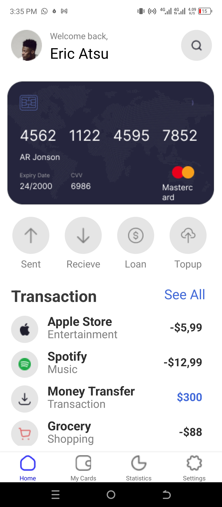
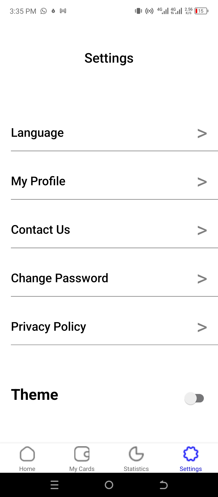
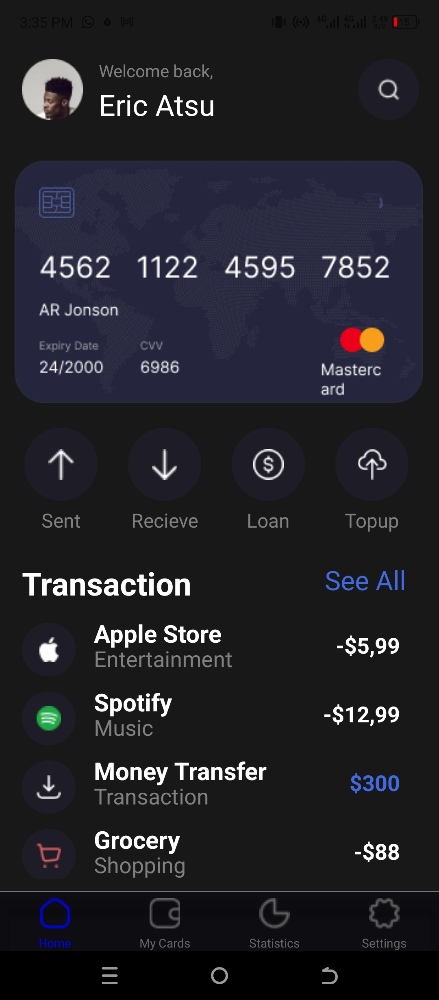
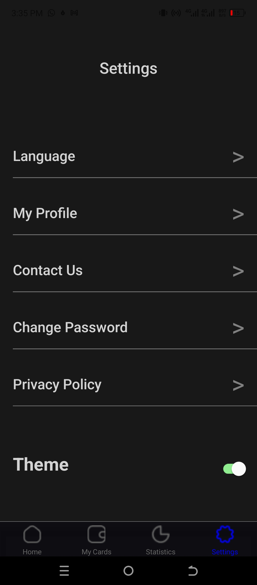

# rn-assignment5-11019735

## Student ID - 11019735

# How The App Was Created

### I used custom components throughout my application

### I used the useState hook to handle states. To be precise, the useState hook handled the enabling of the switch which toggles the screen background color when pressed.

### I employed the bottom tab navigator to move from one screen to another.

# Screenshots

